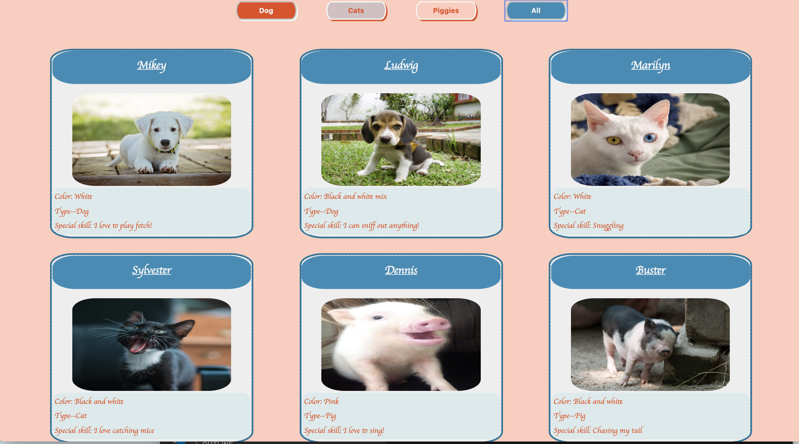
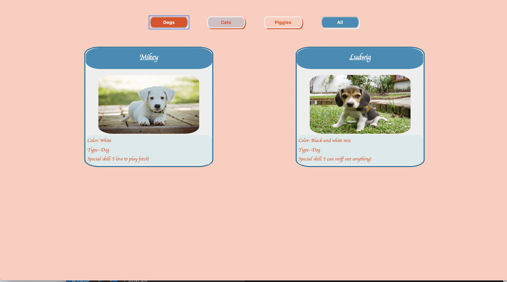
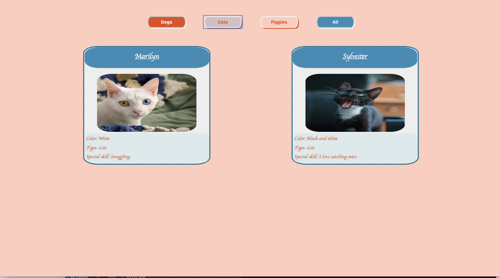
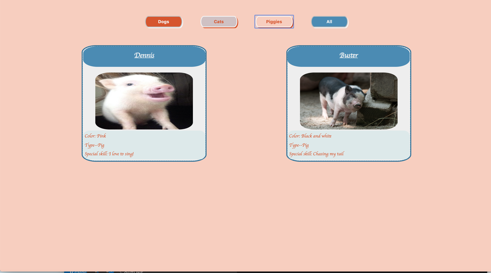

# pet-adoption

## Technologies Used
HTML, CSS, Javascript

## Description
A pet adoption site.  There are 4 buttons in the header, each filtering the different types of animals.

## Screenshots

## How to run
* Clone down this project
* Install http-server from npm
* At the root of this project run the following command: hs -p 8888
* In your browser navigate to https://localhost: 8888